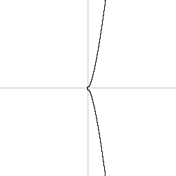

# How is a wallet created?
### A retrospective guide on what the heck happens when you create a wallet.

Ever wondered how wallets work or how secure is the math behind them? This article is for you.

### The randomness

When contructing secure systems, weak points have to be minimized.
When we talk about passwords and secret phrases, we human are not good at remembering complex, long and non logic sense password/data.
So that leads to a lot of us securing our digital assets (email accounts, payments services accounts, every other account, ...),
using weak passwords, and sharing it throw every internet service. These passwords are short and can be stolen by hackers, making them 
gain access to all our accounts. **Single point of failure + really weak one.**

I mean, i cant blame you, the rise of internet has forced us to create an account on every site, situation in which is very difficult
to maintain a reliable OP SEC (security and risk management process).
Password managers have somehow mitigated this problem, by making the SINGLE point of failure dissapear; now if one of your passwords 
is breached, only that account is in risk, the others can remain safe.

Having said that, one solution that cryptocurrencies and Eliptic curves mathematics give us, is to solve partially this weak and subjective
secret utilization: now you dont set your password, you are given a long, complex, random, unique and secure key (a really big number, commonly expressed in alphanumeric characters).
We can use this random key, as a unique key to secure our accounts.
We will call this our private key.
Also, thanks to cryptography, we can use this unique key, to generate an infinite number of other 'associated' private keys, by only remembering a single master key. We can call this the master node or just the seed.

<b>How secure is this number?</b>

256 random bits, assymetric keys, hardened derivation, secp256k1

 <b>How random is this number?</b> 

DICE, secure algorithms

Its notable to say that a lot of secure systems already use this types of secure algorithms underneath to give you extra security when you use them, but the user chosen password weakness is always there.

Let`s stop a little bit:

**PROS:**

- Thanks to elliptic curve mathematics, now you can send information or communicate with other partìes without having to ever enter and nor send your secret key: using **digital signature** (ECDSA: elliptic curve digital signature algorithm).
  
- You have a very **strong unique key**! You can secure a lot of things with it, and rest assured that no one is gonna guess it: only the software that manages it and you!

**CONS:**

- The **single point of failure** still remains somehow: if you give this secret to the wrong person/software, say goodbye to your account/s. This is a flaw that can be solved in some way, by using sepparately several private keys derived from the master seed (common practice in Bitcoin). Smart contract/multisig wallets can solve this at some other degree.
- The long, secure private key now **needs to be stored** in a safe resilent place or remembered (haha, good luck if you wonna try).

**Wallets are the software that save and use this key.**

  
What are these so called wallets?

  
 
A Wallet is this software, in form of a mobile app or a web navigator extension, or a physical device, that is in mainly in charge of two imporant tasks:
- Securing the private key in a safe way (it should never leave this piece of sotware).
- Signing with our private key, the data that needs to be communicated to other system to which we are interacting with.

Those are the basics that wallets need to fulfill.
Luckly a lot of wallets nowadays let us do a lot of other things, such as watching our crypto assets (btc, eth, tokens, nfts) information, swapping them, interacting with other crypto programs (in bitcoin called scripts and in eth called smart contracts).

But what if i cannot access my wallet anymore (lost phone, accidentaly erased, etc.)
Obviously, a copy of our secret key must be done!

####How do we store this?

There are a lot of methods and ways to keep this key in a secure place, but it`s not a trivial task, since we have to keep it secure if we dont want to loose our accounts!.
Storing it in a digital environment (phones, computers, unencrypted usb sticks) seems like a not so good idea, since if someone gains access to this (there a lot of cryptocurrencies scammer and hackers nowadays), they have our secret.
Thats why, a lot of people write this key down  and store it on paper, aka **paper wallets**... but altough its a very good option, it is an annoying task that a lot of us users dont want to perform when they are entering this new world.
Plus, paper is not resistant to fire or water, or can suffer any other potential harm (though the chances of this paper being set on fire are very unlikelly. for water you can wrap it in plastic ;) ).

Some much better options are **hardware wallets**: this is a piece of hardware + software that warranties your private keys never leave the device, not even you can see it (except when you first configure it obviously). But its costly and kind of difficult to use. 
Also, not the entire crypto ecosystem applications support them.
Not the best option for new users definitelly...

One option is to keep this secret very safe, in an offline environment (to avoid digital exposure to hackers or online scams). This can consist, as a common practice, in writing the key down on a paper. Problem solved? No, these keys are random upper and lower case letter and numbers, a mistake writting them and we are lost. Also, these keys are really large (**LONGITUD**). How can we represent this key in a more human readable way?

###The 12/24 words
**(aka: menmonic phrase, secret recovery phrase, etc.)**

These words are a better representation of a random number for us, since our brains can read words and they are trivial (somehow) to write in a legible, less error prone way. There are 2048 words that can be choosen, making the recovery of a  wrongly written word a lot easier. Plus softwares can utilize this dictionary to assist the user in entering the words in a faster and correct way. The words order matters, so make sure you store it as they are shown.

There is still a problem, if someone has these words, they have our accounts! Some wallets implement an extra word to further secure our phrase (sadly not much
wallet`s implement this), using it as a simple password. This is called the 'passphrase' or 'salt' of your mnemonic and its a string or word that you can choose yourself, but you have to always remember it. If someone uses your mnemonic, they couldnt access your accounts without this extra passphrase.

<b>How this dictionary works?</b>

For transforming our random number, something like 'afdfd9c3d2095ef696594f6cedcae59e72dcd697e2a7521b1578140422a4f890' (256 bits - 32 bytes - 64 hex) into a readable phrase of 24 words, we have to perfom some simple steps:

1- Apply a hash to this number (SHA256) and add the last 8 bits (1  byte - 2 hex) of this hash, to the random number, resulting in 264 bits (33 bytes, 66 hex).
2- Split the 264 bits into groups of 11 bits, forming 24 groups.
3- Every group of bits corresponds to a word in the 2048 word lenght dictionary (2^11 = 2048). Just assign the corresponding word according to the resulted number.

As you have noticed, only the 23 first words are the random ones (first 253 bits). There are 3 remaining bits, that concatenated with the last 8 bit of the hash, are used as a checksum, a method to determine that the previos words are not incorrect (if the last 8 bits of the last word, match hash of the 253 + 3 digits of the number).

4- After checking the correct words, we generate the seed or master node which is a 512 bit number.
How can we generate a 512 bits number from a 256 bits input? Using the PBKDF2-HMAC-SHA512 password based key derivation function, which is a key stretching function (results in more bits), that adds extra security for preventing brute-force attacks. The 'salt' or 'passphrase' can be used in this function to add the extra security layer.

<b>How this function works?</b>

Im not an expert in cryptography for explainin the process of this function (and its not that relevant for understanding), but will try to explain the basics for getting to know the why of this step:

The main idea is to hash a secret (in our case the 256/128 bits), using a salt, many times (2048 for our purpose). The salt is the string 'mnemonic' concatenated with the user inputed passphrase or salt.

As the function names defines, the HMAC-SHA512 algorithm is used to hash the secret.

The final purpose of this function is to increase the number of attempts a lucky program has to perform to guess a correct key, since now he needs to try 512 bits numbers, not 256 bits (which already was very difficult to guess). This is called *brute-force attack*. This is because performing this function takes a sustantial amount of time (only microseconds in our processors, but not suitable for doing it a lot of times for guessing)

Sadly for the exploiter, the chances of guessing your number have decreased drastically:
From 8.6361686e-78 = 1 / 2^256
0.000000000000000000000000000000000000000000000000000000000000000000000000000008 %
To 7.458341e-155 = 1 / 2^512
0.00000000000000000000000000000000000000000000000000000000000000000000000000000000000000000000000000000000000000000000000000000000000000000000000000000000007 %

-----------------

As for generating the 12 words, the process is similar, the only difference is that the initial random number is 128 bits long (18 bytes, 32 hex). It`s still secure, remember that the statistics are on our side.

After all, we are inputting chunks of a number in the form of readable words :).

  
Congrats, we have made this secret number a lot more storable and user friendly!

**But the what about using one key to rule them all?**

Here is when things get complicated...

### Derivation paths

Hierachical deterministic wallets implement a key tree, leaded by the master node, from which we can obtain infinite number of other private keys, and its associated public keys.

The derivation path is a route that tells us how to reach our desired child private key, having our own master key. This route looks something like this: m/44'/60'/0'/0/0

There are 5 levels, separated by '/', and each level can have 2^512 childs. Each one of this childs is a private key itself, but they are not used directly, they are only used to continue the path along to get to the desired child. Only the last child (or leaf) is used.

**How this path works?**

Some important thing to understand here, is that after following all that path of calculations, the result is the private key corresponding to that seed and to that derivation path.

Seed A + m/44'/60'/0'/0/0 = private key 1
Seed A + m/44'/1'/0'/0/0 = private key 2
Seed A + m/44'/100'/0'/0/0 = private key 3
Seed B + m/44'/60'/0'/0/0 = private key 4

Only the correct combination of a seed with a derivation path can correspond to an specific key.

### Private key >> Public key >> Address

After all this process, we are left with a private key, but we havent already reach to an address. Dont worry, we are on our last steps, but this part is complicated to understand...

Every private key has a public key, no wonder why they are called key pairs. To calculate it we will use elliptic curve mathematics.

**Are you saying there is a special types of mathematics?**

Once our public key is calculated from our private key, then we need to calculate the address.
The address is a simple representation of our public key, different blockchains choose ways of showing our address that's why we have different addresses formats, but inside they all correspond to the same public key.

public key: 0203191210a1de0935cf4c7dac5660f5070c63c3b424393fd98a566ad87e7a286c
btc address: 15LeXZiHKheLFopdcZjySCAGgYNyri5HDY
eth address: 0x7B4D87763941C9EC403B8612EeAe4e8CB084EECF
tron address: TMDAzURz218sDuGVQoYzDyaG65qa3CyLHM

**How does Bitcoin do this?**

**How does Ethereum do this?**

### Elliptic curves

Elliptic curves are basically a special mathematical function y^2 = x^3+a*x+b, for example, y^2 = x^3 + 7.
These functions, which are defined by cryptographers with different parameters to enable some useful characteristics, like efficient computation, not-back-door enabled (like other supposed NIST curves), etc.

In the cryptocurrencies world, the most famous and broad used curve is the secp256k1 
(Bitcoin and Ethereum use this). There parameters defined for this elliptic curve can be seen here: https://en.bitcoin.it/wiki/Secp256k1.

Geometrically, this curve would look something like this:

The maths behind EC are really interesting, but they need a higher understanding which i dont have, so im trully sorry if you wanted to know more about them.
What`s important for us, is to know that along with these finelly selected parameters, a base or generator point G has been selected, the point where all starts.

#### Digital Signature

One of these curves main purpose is to allow digital signatures, meaning i can prove that i signed a message(consent) by showing my signature:
For this we need another key, the public key, to let the other party check if the signature corresponds to that public key. This public key is not a secret, it`s meant to be shared publicly since it cannot prove any consent alone. The public key can be easilly calculated from the private key.

So, for calculating this public key, we use the EC multiplication of the generator point G, k times, were k is our random secure private key. This can be shown as: P = G * k.
This multiplication means that the G point is sumed to itself k times. But the sum operation on EC is different from normal maths (arithmetic) multiplication.

How can we sum in EC?

The result is a point on the curve, this is our public key (correspondant to our private key k).
Now we can share our compressed public key to the entity we are trying to communicate to.

**Compressed public keys?**

A public key can be expressed in a compressed or uncompressed format.
The uncompressed formats its logically a lot longer since it containes the Y coordinate, but the compressed format ignores this Y value and just sticks to containing the X coordinate and the sign of the Y coordinate (that's sufficient information to recover the point on the curve).
Uncompressed public keys start with 04 and continue with the X coordinate of the point followed by the Y coordinate. This format occupies 513 bits.
Compressed public keys start with 02 or 03 depending on the sign of the Y coordinate of the point, and to recover the Y point, all we need to do is replace the X value on the elliptic curve function. This format occupies 257 bits

Only the signature of our message remains to be generated and transmitted.

How are this signatures generated?

This part is very difficult to explain in simple forms, since it relies on a lot of mathematical understanding. Again, sorry. Maybe some cryptographer can contribute to this guide and solve this puzzle

Now, the destinatary can check that our signature corresponds to our public key, thus verifying the message's origin is valid.